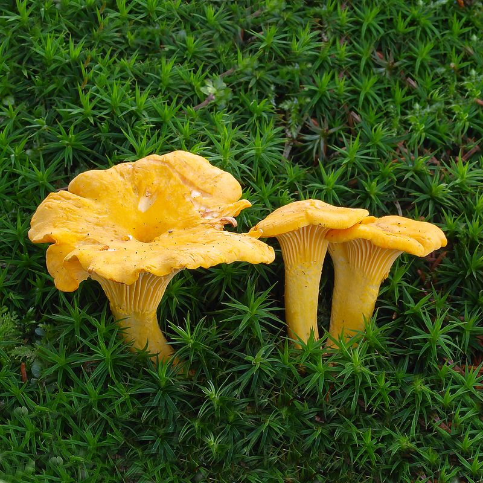
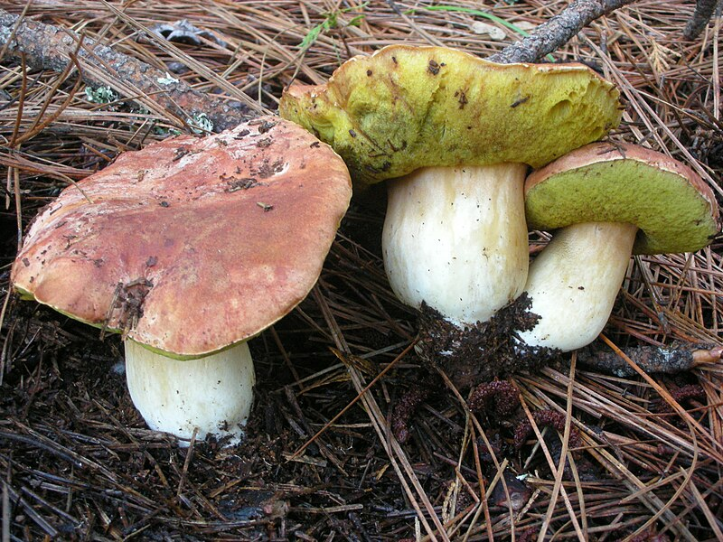
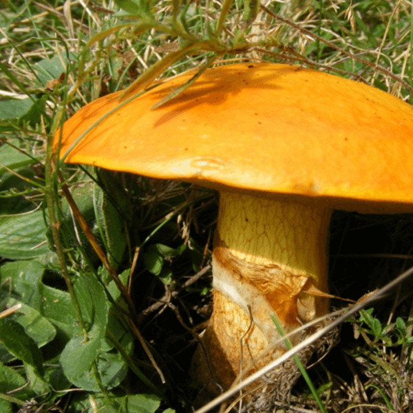

# **Mushrooms**
## **Chanterelle**

The common name of several species of fungi. They are among the most popular of wild edible mushrooms. They are orange, yellow or white, meaty and funnel-shaped. On the lower surface, underneath the smooth cap, most species have rounded, forked folds that run almost all the way down the stipe, which tapers down seamlessly from the cap. Many species emit a fruity aroma, reminiscent of apricots, and often have a mildly peppery taste. The name chanterelle originates from the Greek kantharos meaning "tankard" or "cup", a reference to their general shape.

## **Boletus Rex-Veris**

Commonly known as the spring king bolete. The large, edible fruiting bodies known as mushrooms appear under pine trees. It has a pinkish to brownish cap and its stem is often large and swollen, and the overall colour may have an orange-red tinge. As with other boletes, the size of the fruiting body is variable. Boletus rex-veris is edible, and may be preserved and cooked.

## **Suillus grevillei**

Suillus grevillei (commonly known as Greville's bolete and larch bolete) is a mycorrhizal mushroom with a tight, brilliantly coloured cap, shiny and wet looking with its mucous slime layer. The hymenium easily separates from the flesh of the cap, with a central stalk that is quite slender. The species has a ring or a tight-fitting annular zone.
